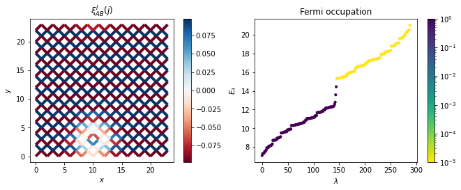
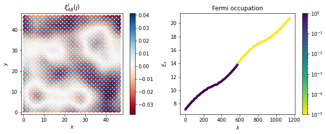
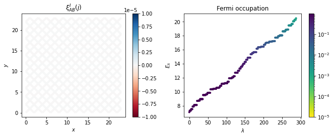

# Welcome to the Topological Mott Insulator toolbox
> A Hartree-Fock library to study an interaction-induced Chern Insulator in the checkerboard lattice.


(under development)

## Install

`to be released`

## How to use

Perform a simple self-consistent algorithm of the unrestricted Hartree-Fock method to compare between site-nematic and quantum anomalous Hall phases.

```
t0, jax, jay, jbx, jby = -1, 0.5, -0.5, -0.5, 0.5 # We fix the hopping parameters of the Hamiltonian
```

### Site-nematic phase

```
nx, ny = 12, 12

v1, v2 = 4., 1.
v3, v4 = Rydberg_v3v4(v1,v2)
un_mf = checkerboard_lattice_un(nx=nx,ny=ny,t0=-1, jax=jax, jay=jay, 
		                        jbx=jbx, jby=jby, v1=v1, v2=v2, v3=v3, v4=v4,
		                        beta=1E+5, cell_filling=1, phix=0., phiy=0., cylinder=False, field=0.*1j, induce='nothing', border=False)

for i1 in (range(0,100)):
    un_mf.iterate_mf(eta=0.6)

for i1 in (range(0,100)):
    un_mf.iterate_mf(eta=1.)    
```

    No handles with labels found to put in legend.


### Quantum Anomalous Hall phase

```
nx, ny = 12, 12
v1, v2 = 4., 2.5
v3, v4 = Rydberg_v3v4(v1,v2)


un_mf = checkerboard_lattice_un(nx=nx,ny=ny,t0=-1, jax=jax, jay=jay, 
		                        jbx=jbx, jby=jby, v1=v1, v2=v2, v3=v3, v4=v4,
		                        beta=1E+5, cell_filling=1, phix=0., phiy=0., cylinder=False, field=0.1*1j, induce='nothing', border=False)

for i1 in range(0,50):
    un_mf.iterate_mf(eta=0.6)

for i1 in range(0,50):
    un_mf.iterate_mf(eta=1.)
    
un_mf.field = 0.

for i1 in (range(0,50)):
    un_mf.iterate_mf(eta=0.6)

for i1 in (range(0,50)):
    un_mf.iterate_mf(eta=1.)
```


### Self-trapped polaron

For a finite hole/particle doping, the unrestricted Hartree-Fock method gives rise to localized solutions due to the appearance of states inside the gap.

```
nx, ny = 12, 12
v1, v2 = 4., 2.5
v3, v4 = Rydberg_v3v4(v1,v2)

cf = (nx*ny+1)/(nx*ny)

un_mf = checkerboard_lattice_un(nx=nx,ny=ny,t0=-1, jax=jax, jay=jay, 
		                        jbx=jbx, jby=jby, v1=v1, v2=v2, v3=v3, v4=v4,
		                        beta=1E+5, cell_filling=cf, phix=0., phiy=0., cylinder=False, field=0.1*1j, induce='nothing', border=False)

for i1 in (range(0,50)):
    un_mf.iterate_mf(eta=0.6)

for i1 in (range(0,50)):
    un_mf.iterate_mf(eta=1.)
    
un_mf.field = 0.

for i1 in (range(0,50)):
    un_mf.iterate_mf(eta=0.6)

for i1 in (range(0,50)):
    un_mf.iterate_mf(eta=1.)
```





### Topological domains

When increasing the number of particles from half filling, the system eventually generates two domains with opposite spontaneous breaking of the time-reversal symmetry

```
nx, ny = 24, 24
v1, v2 = 4., 2.5
v3, v4 = Rydberg_v3v4(v1,v2)

cf = (nx*ny+5)/(nx*ny)

un_mf = checkerboard_lattice_un(nx=nx,ny=ny,t0=-1, jax=jax, jay=jay, 
		                        jbx=jbx, jby=jby, v1=v1, v2=v2, v3=v3, v4=v4,
		                        beta=1E+5, cell_filling=cf, phix=0., phiy=0., cylinder=False, field=0.*1j, induce='nothing', border=False)

for i1 in (range(0,2)):
    un_mf.iterate_mf(eta=0.6)

for i1 in (range(0,2)):
    un_mf.iterate_mf(eta=1.)
```





### Effect of finite temperature 

For increasing temperature the gap of the quantum anomalous Hall phase closes, and eventually the phase disappears. We first consider the effect of a small temperature $T/t=0.1$, for which no important changes are observed compared to the zero temperature case shown in the first example.

```
nx, ny = 12, 12
v1, v2 = 4., 2.5
v3, v4 = Rydberg_v3v4(v1,v2)


un_mf = checkerboard_lattice_un(nx=nx,ny=ny,t0=-1, jax=jax, jay=jay, 
		                        jbx=jbx, jby=jby, v1=v1, v2=v2, v3=v3, v4=v4,
		                        beta=10, cell_filling=1, phix=0., phiy=0., cylinder=False, field=0.1*1j, induce='nothing', border=False)

for i1 in range(0,50):
    un_mf.iterate_mf(eta=0.6)

for i1 in range(0,50):
    un_mf.iterate_mf(eta=1.)
    
un_mf.field = 0.

for i1 in (range(0,50)):
    un_mf.iterate_mf(eta=0.6)

for i1 in (range(0,50)):
    un_mf.iterate_mf(eta=1.)
```


The situation is different for $T/t=0.2$ where we observe that the upper band begins to have a finite population.


For $T/t=1$ the quantum anomalous Hall phase has disappeared: the system is not gapped at all and there is no spontaneous time-reversal symmetry breaking in the nearest-neighbors hoppings.




