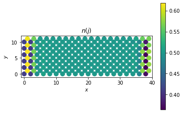

# Welcome to the Topological Mott Insulator, a Hartree-Fock toolbox
> Summary description here.


This file will become your README and also the index of your documentation.

## Install

`to be released`

## How to use

Perform a simple self-consistent algorithm to compare unrestricted and restricted Hartree-Fock results

```
nx, ny = 8, 8
stagg_m = 0
cf = (nx*ny)/(nx*ny)
t0=-1
jax, jay, jbx, jby = +0.5, -0.5, -0.5, +0.5
phix, phiy = 0., 0.

un_mf = checkerboard_lattice_un(nx=nx,ny=ny,t0=-1, jax=+0.5, jay=-0.5, 
		                        jbx=-0.5, jby=+0.5, v1=2.5, v2=1.5,
		                        beta=100000, cell_filling=cf, phix=0., phiy=0.)

re_mf = checkerboard_lattice_4unitcell(nx=nx,ny=ny,t0=-1,jax=+0.5, jay=-0.5, 
		                        jbx=-0.5, jby=+0.5, v1=2.5, v2=1.5,  
		                        beta=100000, cell_filling=cf)

for i1 in (range(0,200)):
        un_mf.iterate_mf(eta=0.6)
        re_mf.iterate_mf()

for i1 in (range(0,200)):
        un_mf.iterate_mf(eta=1.)
        re_mf.iterate_mf()
```

```
un_mf_aux = un_mf
fig  = plt.figure()
gs0 = gridspec.GridSpec(1, 1, left=0.12, right=0.75, top=1., bottom=0., wspace=0)
gs00 = gridspec.GridSpecFromSubplotSpec(1, 1, subplot_spec=gs0[0], hspace=0., wspace=0.)
ax = fig.add_subplot(gs00[0])

segment, color, mini, maxi = tools.plot_bonds(un_mf_aux.pos, un_mf_aux.J_nn, np.imag(un_mf_aux.mfhop_nn))
ligne = LineCollection(segment,linestyles='solid',
                                cmap=plt.get_cmap('RdBu'),
                                array=color, norm=plt.Normalize(mini, maxi),
                                linewidths=8, rasterized=True)
 
ax.set_xlim(-1,2*un_mf_aux.nx)
ax.set_ylim(-1,2*un_mf_aux.ny)
ax.add_collection(ligne)
ax.set_xlabel(r'$x$')
ax.set_ylabel(r'$y$')
cbar = fig.add_axes([0.77, 0.2, 0.06, 0.6])
fig.colorbar(ligne, cax=cbar)
ax.set_aspect('equal')
plt.title(r'$\xi_{AB}^I(j)$')
plt.show()
```





```
fig  = plt.figure()
gs0 = gridspec.GridSpec(1, 1, left=0.12, right=0.75, top=1., bottom=0., wspace=0)
gs00 = gridspec.GridSpecFromSubplotSpec(1, 1, subplot_spec=gs0[0], hspace=0., wspace=0.)
ax = fig.add_subplot(gs00[0])

segment, color, mini, maxi = tools.plot_bonds(un_mf.pos, un_mf.J_ax, np.imag(un_mf.mfhop_ax))
ligne = LineCollection(segment,linestyles='solid',
                                cmap=plt.get_cmap('RdBu'),
                                array=color, norm=plt.Normalize(mini, maxi),
                                linewidths=5, rasterized=True)
ax.add_collection(ligne)
segment, color, mini, maxi = tools.plot_bonds(un_mf.pos, un_mf.J_ay, -np.imag(un_mf.mfhop_ay))
ligne = LineCollection(segment,linestyles='solid',
                                cmap=plt.get_cmap('RdBu'),
                                array=color, norm=plt.Normalize(mini, maxi),
                                linewidths=5, rasterized=True)
ax.add_collection(ligne)

segment, color, mini, maxi = tools.plot_bonds(un_mf.pos, un_mf.J_bx, -np.imag(un_mf.mfhop_bx))
ligne = LineCollection(segment,linestyles='solid',
                                cmap=plt.get_cmap('RdBu'),
                                array=color, norm=plt.Normalize(mini, maxi),
                                linewidths=5, rasterized=True)
ax.add_collection(ligne)

segment, color, mini, maxi = tools.plot_bonds(un_mf.pos, un_mf.J_by, np.imag(un_mf.mfhop_by))
ligne = LineCollection(segment,linestyles='solid',
                                cmap=plt.get_cmap('RdBu'),
                                array=color, norm=plt.Normalize(mini, maxi),
                                linewidths=5, rasterized=True)
ax.add_collection(ligne)

ax.set_xlim(-1,2*un_mf.nx)
ax.set_ylim(-1,2*un_mf.ny)
ax.set_xlabel(r'$x$')
ax.set_ylabel(r'$y$')
cbar = fig.add_axes([0.77, 0.2, 0.06, 0.6])
fig.colorbar(ligne, cax=cbar)
ax.set_aspect('equal')
plt.title(r'$\xi_{AB}^I(j)$')
plt.show()
```


```
fig  = plt.figure()
gs0 = gridspec.GridSpec(1, 1, left=0.12, right=0.75, top=1., bottom=0., wspace=0)
gs00 = gridspec.GridSpecFromSubplotSpec(1, 1, subplot_spec=gs0[0], hspace=0., wspace=0.)
ax = fig.add_subplot(gs00[0])
#ax2 = fig.add_subplot(gs00[1])

sc = ax.scatter(un_mf.pos[:,0].flatten(),
                un_mf.pos[:,1].flatten(), c=np.real(un_mf.mfden),  s=150)
ax.set_aspect(aspect='equal')
ax.minorticks_on()
ax.set_xlim(-1,2*un_mf.nx)
ax.set_ylim(-1,2*un_mf.ny)
ax.set_xlabel(r'$x$')
ax.set_ylabel(r'$y$')
cbar = fig.add_axes([0.77, 0., 0.06, 1.])
cb1 = fig.colorbar(sc, cax=cbar, orientation='vertical')
plt.title(r'$n(j)$')
plt.show()
```


