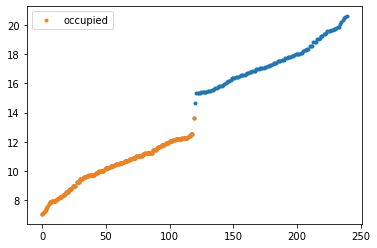

# Welcome to the Topological Mott Insulator toolbox
> A Hartree-Fock library to study an interaction-induced Chern Insulator in the checkerboard lattice.


(under development)

## Install

`to be released`

## How to use

Perform a simple self-consistent algorithm to compare unrestricted and restricted Hartree-Fock results

```
nx, ny = 20, 6
t0 = -1
jax, jay, jbx, jby = 0.5, -0.5, -0.5, 0.5
v1, v2 = 4, 2.5
tau = np.copy(v1/v2)
alpha = ((tau-1)/(8-tau))**(1/6)
kappa = v1*(1+alpha**6)

v3 = kappa*(1/(1+(2*alpha)**6))
v4 = kappa*(1/(1+(np.sqrt(5)*alpha)**6))

cf = (nx*ny)/(nx*ny)
phix, phiy = 0., 0.
beta = 1E+5

un_mf = checkerboard_lattice_un(nx=nx,ny=ny,t0=-1, jax=jax, jay=jay, 
		                        jbx=jbx, jby=jby, v1=v1, v2=v2, v3=v3, v4=v4,
		                        beta=beta, cell_filling=cf, phix=phix, phiy=phiy, cylinder=True, field=0.1*1j, induce='nothing', border=True)

re_mf = checkerboard_lattice_4unitcell(nx=nx,ny=ny,t0=t0,jax=jax, jay=jay, 
		                        jbx=jbx, jby=jby, v1=v1, v2=v2,  
		                        beta=beta, cell_filling=cf)

for i1 in (range(0,10)):
    un_mf.iterate_mf(eta=0.6)
    re_mf.iterate_mf()

for i1 in (range(0,10)):
    un_mf.iterate_mf(eta=1.)
    re_mf.iterate_mf()

un_mf.field = 0.

for i1 in (range(0,10)):
    un_mf.iterate_mf(eta=0.6)
    re_mf.iterate_mf()

for i1 in (range(0,10)):
    un_mf.iterate_mf(eta=1.)
    re_mf.iterate_mf()
```

```
fig  = plt.figure()
ax = fig.add_subplot()
sc = ax.scatter(un_mf.pos[:,0].flatten(),
                un_mf.pos[:,1].flatten(), c=np.real(un_mf.mfden),  s=80)


ax.set_xlim(-1,2*un_mf.nx)
ax.set_ylim(-1,2*un_mf.ny)
ax.set_xlabel(r'$x$')
ax.set_ylabel(r'$y$')
ax.set_aspect('equal')
fig.colorbar(sc)
plt.title(r'$n(j)$')
plt.show()
```


```
fig  = plt.figure()
ax = fig.add_subplot()

segment, color, mini, maxi = plot_bonds(un_mf.pos, un_mf.J_nn, np.imag(un_mf.mfhop_nn))
ligne = LineCollection(segment,linestyles='solid',
                                cmap=plt.get_cmap('RdBu'),
                                array=color, norm=plt.Normalize(mini, maxi),
                                linewidths=4, rasterized=True)
 
ax.set_xlim(-1,2*un_mf.nx)
ax.set_ylim(-1,2*un_mf.ny)
ax.add_collection(ligne)
ax.set_xlabel(r'$x$')
ax.set_ylabel(r'$y$')
fig.colorbar(ligne)
ax.set_aspect('equal')
plt.title(r'$\xi_{AB}^I(j)$')
plt.show()
```


```
fig  = plt.figure()
ax = fig.add_subplot()

aux = np.concatenate((np.imag(un_mf.mfhop_ax), np.imag(un_mf.mfhop_ay), np.imag(un_mf.mfhop_bx), np.imag(un_mf.mfhop_ax)))
maxi = np.amax(np.abs(aux))
segment, color, mini_, maxi_ = plot_bonds(un_mf.pos, un_mf.J_ax, np.imag(un_mf.mfhop_ax))
ligne = LineCollection(segment,linestyles='solid',
                                cmap=plt.get_cmap('RdBu'),
                                array=color, norm=plt.Normalize(-maxi, maxi),
                                linewidths=5, rasterized=True)
ax.add_collection(ligne)
segment, color, mini_, maxi_ = plot_bonds(un_mf.pos, un_mf.J_ay, -np.imag(un_mf.mfhop_ay))
ligne = LineCollection(segment,linestyles='solid',
                                cmap=plt.get_cmap('RdBu'),
                                array=color, norm=plt.Normalize(-maxi, maxi),
                                linewidths=5, rasterized=True)
ax.add_collection(ligne)

segment, color, mini_, maxi_ = plot_bonds(un_mf.pos, un_mf.J_bx, -np.imag(un_mf.mfhop_bx))
ligne = LineCollection(segment,linestyles='solid',
                                cmap=plt.get_cmap('RdBu'),
                                array=color, norm=plt.Normalize(-maxi, maxi),
                                linewidths=5, rasterized=True)
ax.add_collection(ligne)

segment, color, mini_, maxi_ = plot_bonds(un_mf.pos, un_mf.J_by, np.imag(un_mf.mfhop_by))
ligne = LineCollection(segment,linestyles='solid',
                                cmap=plt.get_cmap('RdBu'),
                                array=color, norm=plt.Normalize(-maxi, maxi),
                                linewidths=5, rasterized=True)
ax.add_collection(ligne)

ax.set_xlim(-1,2*un_mf.nx)
ax.set_ylim(-1,2*un_mf.ny)
ax.set_xlabel(r'$x$')
ax.set_ylabel(r'$y$')
ax.set_ylim()
fig.colorbar(ligne)
ax.set_aspect('equal')
plt.title(r'$\xi_{AA/BB}^I(j)$')
plt.show()
```


```
plt.plot(un_mf.energies,'.')
plt.plot(un_mf.energies_fermi,'.', label='occupied')
plt.legend()
```


    <matplotlib.legend.Legend at 0x11ba52f10>




